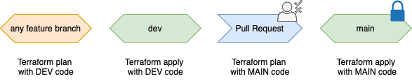
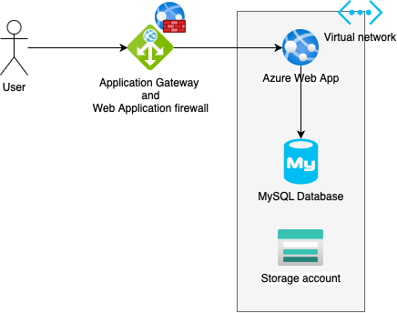

## GitOps infrastructure automation

This repository contains Terraform infrastructure code and automated CI/CD pipelines for infrastructure deployment.

Automation is implemented with Azure Pipelines.

Every time `terraform plan` is executed (feature branches, pull requests, apply), the pipeline first runs `terraform validate` and `terraform fmt -check`.

Feature branches: run `terraform plan` only

`dev` branch: automatically `terraform apply` to the development environment.

Pull request from `dev` to `main`: run `terraform plan` for the production environment.

Merge to `main`: automatically `terraform apply` to the production environment.

## Application GitOps strategy

## Application resources

---

### Cloud resources 

- Application Gateway with Web Application Firewall – the only public endpoint.
- Linux Web App (App Service)
- Storage Account 
- MySQL Flexible Server
- Virtual Network with subnets for gateway, app and database.

**Access**

All traffic first hits the Application Gateway and then goes to the app over the private network. The database is in a private subnet and only the app can reach it.

